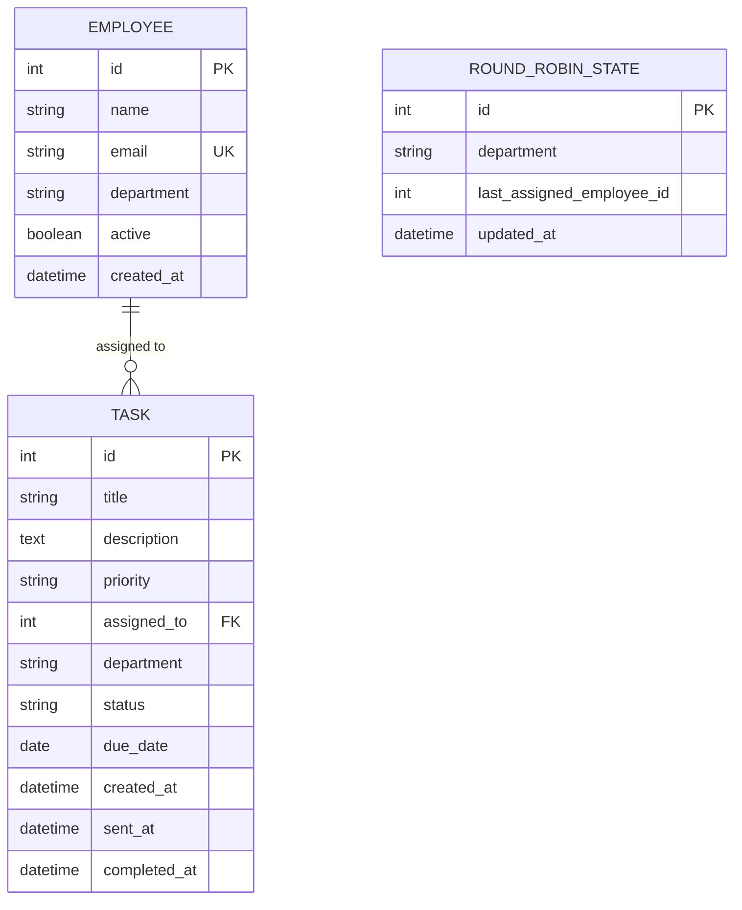

# Belvo — Automated Task Allotment via Email (Frontend & Backend)

> **Intern Project Implementation: Core HR Task Management Platform & REST API Engine**  
> **Repository:** [https://github.com/budigeashwinigoud-glitch/Email-Automation](https://github.com/budigeashwinigoud-glitch/Email-Automation)

---

## 📌 Scope of Responsibility & Separation of Concerns

I am responsible **ONLY** for the **FRONTEND and BACKEND** systems.

### 🚫 Excluded from this Scope (To Be Built by Teammate)
The following modules are **intentionally not implemented here** and will be handled by a dedicated email scheduler microservice built by another teammate:
- No Gmail OAuth or Gmail integration
- No direct SMTP clients
- No third-party email providers (SendGrid, Mailgun, AWS SES)
- No actual outgoing email delivery
- No background cron jobs, Celery workers, APScheduler, or node-cron

### 🔌 Teammate Integration Contract
The backend exposes clean, production-grade endpoints for the external email automation worker to consume:
1. **`GET /api/tasks/pending`**: Retrieves all tasks queued for email dispatch along with assigned employee contact details.
2. **`PATCH /api/tasks/{id}/status`**: Allows the worker to advance task status to `sent` (email delivered) or `done` (task completed), automatically capturing server audit timestamps (`sent_at`, `completed_at`).

---

## 🚀 What Was Built Until Now (Completed Deliverables)

### 1. Department Architecture & Dynamic Organization Structure
- [x] **11 Predefined Departments**: Built-in support for all organizational departments:
  1. **WhatsApp Marketing**
  2. **Social Media Manager**
  3. **HR**
  4. **Analyst Department**
  5. **Talented Engineers**
  6. **Cybersecurity**
  7. **AI/ML Department**
  8. **Web Developer**
  9. **Software Developers**
  10. **Graphic**
  11. **Founder Office**
- [x] **"Other" Custom Department Creation**: Users can select *"Other (Create New Department)"* across all employee and task modals, which opens an input field to create and enter new departments manually. Newly created departments immediately appear across all dropdowns and filters.
- [x] **Department-Based Employee Selection**: When allotting tasks manually, selecting a department instantly filters the employee dropdown to display only active staff belonging to that specific department.
- [x] **Department-Specific Round-Robin Rotation**: When auto-assigning a task with a department chosen, the round-robin engine deterministically cycles through active employees within that department pool.
- [x] **Department Visibility & Filtering**: Department badges and columns displayed across the Task Table, Kanban Board, Employee Grid Cards, Employee Table, and Task Details Modal, with real-time department filter dropdowns.

### 2. HR Web Dashboard (Frontend)
- [x] **Dual Viewing Modes**: Seamless toggle between an interactive **Data Table** and a visual **Kanban Board** (`Pending Delivery` → `Sent / In Progress` → `Completed`).
- [x] **Zero Default Values Constraint**: Forms (Task Creation, Employee Registration, Priority, Due Date, Assignment Mode) start completely empty without assumptions, enforcing deliberate user input.
- [x] **Clean Database Initialization**: No fake or hardcoded mock data seeded on startup; the application starts with zero default tasks and zero default employees.
- [x] **Zero-Lag Optimistic UI Engine**:
  - **Instant Task Allotment**: Submitting a task immediately renders the new task in the table and increments metrics counters with 0ms perceived latency.
  - **Silent Background Sync**: Server data refreshes quietly in the background without unmounting the table or flashing jarring loading spinners.
  - **Prompt Modal Lifecycle**: Modals dismiss instantaneously upon confirmation while network operations run asynchronously.
  - **Input Memoization**: Active staff lists and departmental filters in forms are strictly memoized via `useMemo`, preventing typing lag and unnecessary re-renders.
  - **Instant Status Transitions**: Advancing task states (pending $\rightarrow$ sent $\rightarrow$ done) updates badges with zero delay.
- [x] **Live Task Search & Multi-Criteria Filtering**: Instant client-side search across task titles, descriptions, employee names, and emails, combined with backend filters by Status, Assignee, Priority, and Department.
- [x] **Staff Management Directory (Add & Delete)**:
  - **Add Employee**: Register staff with full name, unique corporate email, and department assignment (predefined or custom). Includes a direct quick-add button in empty states.
  - **Delete Employee (Permanent Cascade)**: Red `Trash2` action on both Grid and Table views with confirmation modal. Permanently removes the employee, cleans up all their assigned tasks, and resets any active round-robin pointers referencing them.
  - **Edit Employee**: Update name, email, department, or active status on the fly.
  - **Soft Deactivation**: Inactive toggle preserves historical records while bypassing staff from future round-robin allotments.
  - **Workload Analytics**: Per-employee visual workload progress bars and task completion breakdown.
- [x] **De-cluttered, Modern UI/UX**: Removed redundant corner widgets, testing simulators, and duplicate notices for a clean, distraction-free enterprise interface.

### 3. FastAPI REST Engine & Database (Backend)
- [x] **High-Performance Asynchronous REST API**: Built with FastAPI, Pydantic v2 schemas, and strict request/response data validation.
- [x] **SQLite Database & SQLAlchemy 2.0 ORM**: Fully relational schema with `employees`, `tasks`, and `round_robin_state` tables.
- [x] **Complete Employee Lifecycle & Cascade Deletion**:
  - `DELETE /api/employees/{id}?permanent=true`: Permanently deletes employee, deletes their assigned tasks, and resets round-robin state.
  - `DELETE /api/employees/{id}?permanent=false`: Soft-deactivates employee for audit preservation.
- [x] **Deterministic Round-Robin Algorithm**:
  - Cyclically distributes tasks across dynamic numbers of active employees ($N \ge 1$).
  - Persists rotation state directly in SQLite (`round_robin_state`), making it completely resilient across backend server restarts.
  - Seamlessly skips deactivated employees and incorporates newly added staff into future rounds.
  - Supports both global and per-department round-robin states.
  - Manual assignments do not alter or disrupt the cyclical sequence.
- [x] **Automated Audit Timestamps**: Accurate tracking of `created_at`, `sent_at`, and `completed_at` with UTC timezone awareness.
- [x] **Real-Time Aggregations**: `/api/dashboard/stats` delivers live counts for total tasks, pending, sent, done, active employees, and workload distribution.

### 4. Automated Testing Suite
- [x] **36 Pytest Unit & Integration Tests**: Comprehensive automated test coverage including:
  - Global and per-department round-robin cycle verification.
  - Algorithm persistence across database sessions and service restarts.
  - Inactive employee bypass and dynamic employee entry into future rounds.
  - Task creation, validation, filtering, status transitions, and deletion.
  - Employee uniqueness validation, updates, soft-deactivation, and permanent cascade deletion.

---

## 🛠️ System Architecture

```
┌────────────────────────────────────────────────────────┐
│                   HR Manager (Web UI)                  │
│   • Task Intake & Assignment (Auto / Manual)           │
│   • Department Selection & Custom Department Creation  │
│   • Live Kanban Board & Task Table Views               │
│   • Staff Directory & Workload Metrics                 │
└───────────────────────────┬────────────────────────────┘
                            │ HTTP / JSON
                            ▼
┌────────────────────────────────────────────────────────┐
│                   FastAPI Backend                      │
│   • REST Routes: /api/tasks, /api/employees, /stats    │
│   • Departmental Deterministic Round-Robin Service     │
│   • Pydantic v2 Validation & Relationship Handling     │
└───────────────────────────┬────────────────────────────┘
                            │ SQLAlchemy ORM
                            ▼
┌────────────────────────────────────────────────────────┐
│                 SQLite Database (belvo.db)             │
│   • employees (id, name, email, department, active)    │
│   • tasks (id, title, desc, dept, status, dates)       │
│   • round_robin_state (dept, last_assigned_id)         │
└───────────────────────────▲────────────────────────────┘
                            │
               ┌────────────┴────────────┐
               │  Future Email Worker    │
               │  (Teammate's Scope)     │
               │  GET  /api/tasks/pending│
               │  PATCH /tasks/{id}/stat │
               └─────────────────────────┘
```

---

## 🗄️ Database Entity-Relationship Diagram



---

## 📋 API Endpoints Reference

### 1. Employees (`/api/employees`)
| Method | Endpoint | Description |
| :--- | :--- | :--- |
| `GET` | `/api/employees` | List employees. Optional query filters: `?active=true` and `?department=...` |
| `POST` | `/api/employees` | Register new employee (validates unique email, accepts department) |
| `GET` | `/api/employees/{id}` | Retrieve single employee details by ID |
| `PUT` | `/api/employees/{id}` | Update employee name, email, department, or active status |
| `DELETE`| `/api/employees/{id}` | Soft-deactivate employee (`active = false`), preserving task records |
| `DELETE`| `/api/employees/{id}?permanent=true` | Permanently delete employee from database, delete assigned tasks, and reset round-robin state |

### 2. Tasks (`/api/tasks`)
| Method | Endpoint | Description |
| :--- | :--- | :--- |
| `POST` | `/api/tasks` | Create task with manual ID or `assignee="auto"` (supports department rotation) |
| `GET` | `/api/tasks` | List tasks (newest first, filters by `status`, `assignee`, `priority`, `department`) |
| `GET` | `/api/tasks/pending` | **Email Automation Integration**: Retrieve all tasks with status `pending` |
| `GET` | `/api/tasks/{id}` | Retrieve single task with employee details |
| `PUT` | `/api/tasks/{id}` | Update task title, description, priority, due date, department, assignee |
| `PATCH`| `/api/tasks/{id}/status` | Advance status (`pending` → `sent` → `done`), auto-updating audit timestamps |
| `DELETE`| `/api/tasks/{id}` | Delete task record |

### 3. Dashboard Analytics (`/api/dashboard`)
| Method | Endpoint | Description |
| :--- | :--- | :--- |
| `GET` | `/api/dashboard/stats` | Real-time task status counters and per-employee workload distribution |

---

## 💻 Setup & Installation Guide

### Prerequisites
- Python 3.10+
- Node.js 18+ and npm

---

### Backend Setup

```bash
# 1. Open a terminal and navigate to the backend folder
cd backend

# 2. Create and activate a virtual environment
# Windows (PowerShell):
python -m venv venv
.\venv\Scripts\Activate.ps1
# macOS / Linux:
# python3 -m venv venv
# source venv/bin/activate

# 3. Install dependencies
pip install -r requirements.txt

# 4. Start the backend server
python -m uvicorn app.main:app --port 8000 --reload
```

- Backend API: **http://localhost:8000**
- Interactive Swagger API Documentation: **http://localhost:8000/docs**

---

### Frontend Setup

```bash
# 1. Open a new terminal and navigate to the frontend folder
cd frontend

# 2. Install npm dependencies
npm install

# 3. Run development server
npm run dev
```

- Web Application: **http://localhost:5173**

---

## 🧪 Running Automated Tests

Run the full pytest suite from the `backend/` directory:

```bash
cd backend
.\venv\Scripts\pytest -v
```

**Results:**
```
============================= test session starts =============================
collected 35 items

tests/test_assignment.py::test_round_robin_cycle_5_employees PASSED      [  2%]
tests/test_assignment.py::test_round_robin_with_different_employee_counts PASSED [  5%]
tests/test_assignment.py::test_round_robin_persistence_after_restart PASSED [  8%]
tests/test_assignment.py::test_deactivated_employee_skipped PASSED       [ 11%]
tests/test_assignment.py::test_new_employee_enters_future_round_robin PASSED [ 14%]
tests/test_assignment.py::test_manual_assignment_does_not_advance_round_robin PASSED [ 17%]
tests/test_assignment.py::test_no_active_employees_returns_error PASSED  [ 20%]
tests/test_dashboard.py::test_dashboard_stats_empty PASSED               [ 22%]
tests/test_dashboard.py::test_dashboard_stats_with_data PASSED           [ 25%]
tests/test_employees.py::test_get_employees_empty PASSED                 [ 28%]
tests/test_employees.py::test_create_employee PASSED                     [ 31%]
tests/test_employees.py::test_create_duplicate_employee_email PASSED     [ 34%]
tests/test_employees.py::test_create_employee_invalid_name_or_email PASSED [ 37%]
tests/test_employees.py::test_get_employees_with_active_filter PASSED    [ 40%]
tests/test_employees.py::test_get_single_employee PASSED                 [ 42%]
tests/test_employees.py::test_get_single_employee_not_found PASSED       [ 45%]
tests/test_employees.py::test_update_employee PASSED                     [ 48%]
tests/test_employees.py::test_update_employee_duplicate_email PASSED     [ 51%]
tests/test_employees.py::test_deactivate_employee PASSED                 [ 52%]
tests/test_employees.py::test_create_and_filter_employee_department PASSED [ 55%]
tests/test_employees.py::test_delete_employee_permanent PASSED           [ 58%]
tests/test_tasks.py::test_create_task_manual_assignment PASSED           [ 61%]
tests/test_tasks.py::test_create_task_inactive_employee PASSED           [ 63%]
tests/test_tasks.py::test_create_task_invalid_employee PASSED            [ 66%]
tests/test_tasks.py::test_create_task_invalid_priority PASSED            [ 69%]
tests/test_tasks.py::test_create_task_missing_required_fields PASSED     [ 72%]
tests/test_tasks.py::test_get_tasks_and_sorting PASSED                   [ 75%]
tests/test_tasks.py::test_filter_tasks PASSED                            [ 77%]
tests/test_tasks.py::test_get_pending_tasks PASSED                       [ 80%]
tests/test_tasks.py::test_get_single_task PASSED                         [ 83%]
tests/test_tasks.py::test_get_single_task_not_found PASSED               [ 86%]
tests/test_tasks.py::test_update_task PASSED                             [ 88%]
tests/test_tasks.py::test_update_task_status_and_timestamps PASSED       [ 91%]
tests/test_tasks.py::test_update_task_status_invalid PASSED              [ 94%]
tests/test_tasks.py::test_delete_task PASSED                             [ 97%]
tests/test_tasks.py::test_create_task_with_department_and_round_robin PASSED [100%]

======================== 36 passed in 0.64s ========================
```

---

## 🤝 Hand-off Guide for the Email Automation Service

When your teammate begins building the email dispatch service:

### Step 1: Poll Pending Tasks
The email microservice polls pending tasks:
```http
GET http://localhost:8000/api/tasks/pending
```
**Sample Response:**
```json
[
  {
    "id": 1,
    "title": "Build WhatsApp Campaign Flow",
    "description": "Set up webhook receivers and automated messaging template.",
    "priority": "High",
    "department": "WhatsApp Marketing",
    "status": "pending",
    "due_date": "2026-10-15",
    "assigned_to": {
      "id": 2,
      "name": "Alex Rivera",
      "email": "alex.rivera@belvo.internal",
      "department": "WhatsApp Marketing"
    },
    "created_at": "2026-09-25T10:00:00Z"
  }
]
```

### Step 2: Mark Email as Dispatched
Once the teammate's service successfully sends the email to `assigned_to.email`:
```http
PATCH http://localhost:8000/api/tasks/1/status
Content-Type: application/json

{
  "status": "sent"
}
```
The backend automatically timestamps `sent_at` and transitions the task to `sent`.

### Step 3: Mark Task as Completed
When the assignee completes the task:
```http
PATCH http://localhost:8000/api/tasks/1/status
Content-Type: application/json

{
  "status": "done"
}
```
The backend automatically timestamps `completed_at` and transitions the task to `done`.
