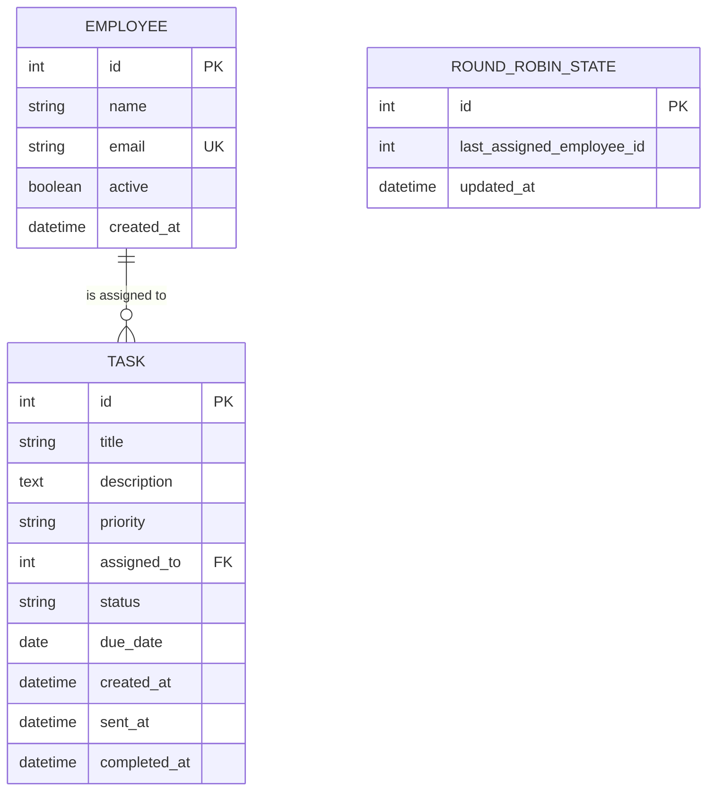

# Belvo — Automated Task Allotment via Email (Frontend & Backend)

**Intern Project Core Implementation: HR Dashboard & REST API Engine**

> [!IMPORTANT]
> **Separation of Concerns: Email Delivery & Automation**  
> Email delivery and scheduled automation are **intentionally separated** from this frontend/backend module. Another teammate is responsible for implementing the email sending service and scheduler.  
> 
> The future email automation service integrates seamlessly using:
> - `GET /api/tasks/pending` to retrieve tasks queued for dispatch.
> - `PATCH /api/tasks/{task_id}/status` to update delivery status (`sent` or `done`).

---

## 1. Project Overview

The **Belvo Automated Task Allotment System** is an enterprise-grade HR task management tool. It enables HR managers to intake, assign, track, and manage employee tasks with deterministic round-robin or manual assignment, real-time status tracking, and automated lifecycle transitions.

```
HR Manager
    ↓  Creates task via React Dashboard
FastAPI Backend
    ↓  Validates, persists, & assigns (Manual or Deterministic Round-Robin)
SQLite Database
    ↓  Task saved with status = 'pending'
Future Email Service
    ↓  Fetches pending tasks: GET /api/tasks/pending
    ↓  Dispatches email notification to assignee
    ↓  Updates status: PATCH /api/tasks/{id}/status → "sent"
Employee Completes Task
    ↓  Updates status: PATCH /api/tasks/{id}/status → "done"
```

---

## 2. Objective

To deliver a production-style, modular, robust **Frontend and Backend** system:
- **HR Web Dashboard**: Create tasks, view live statistics, filter tasks, edit details, and manage dynamic employee directories.
- **Backend API & ORM**: Fast, asynchronous REST API with validation, relationships, and error handling.
- **Deterministic Round-Robin Allotment**: Scalable algorithm that handles arbitrary employee counts, server restarts, inactive employee skipping, and dynamic additions.
- **Integration Endpoints**: Clean, standardized endpoints ready for the email automation microservice.

---

## 3. Architecture

```
belvo/
├── backend/
│   ├── app/
│   │   ├── main.py               # FastAPI application & lifespan startup
│   │   ├── config.py             # Pydantic BaseSettings & env configs
│   │   ├── database.py           # SQLAlchemy engine & session factory
│   │   ├── models.py             # Employee, Task, RoundRobinState models
│   │   ├── schemas.py            # Pydantic v2 validation & response schemas
│   │   ├── seed.py               # Configurable initial employee seed data
│   │   ├── routes/
│   │   │   ├── employees.py      # Employee CRUD & deactivation routes
│   │   │   ├── tasks.py          # Task intake, filtering, & pending endpoint
│   │   │   └── dashboard.py      # Live statistical aggregations
│   │   └── services/
│   │       └── assignment.py     # Persistent round-robin algorithm
│   ├── tests/
│   │   ├── conftest.py           # In-memory test fixtures & TestClient
│   │   ├── test_assignment.py    # Round-robin lifecycle & persistence tests
│   │   ├── test_employees.py     # Employee management & validation tests
│   │   ├── test_tasks.py         # Task CRUD, filters, & status tests
│   │   └── test_dashboard.py     # Statistics calculation tests
│   ├── requirements.txt
│   ├── .env.example
│   └── README.md
│
├── frontend/
│   ├── src/
│   │   ├── components/
│   │   │   ├── Header.jsx
│   │   │   ├── Sidebar.jsx
│   │   │   ├── StatsCards.jsx
│   │   │   ├── TaskTable.jsx
│   │   │   ├── CreateTaskModal.jsx
│   │   │   ├── EditTaskModal.jsx
│   │   │   ├── TaskDetailsModal.jsx
│   │   │   ├── ConfirmModal.jsx
│   │   │   └── Toast.jsx
│   │   ├── pages/
│   │   │   ├── Dashboard.jsx     # Main HR view with metrics & filters
│   │   │   └── Employees.jsx     # Employee directory & management
│   │   ├── services/
│   │   │   └── api.js            # Centralized API service
│   │   ├── styles/
│   │   │   └── index.css         # Modern, responsive design system
│   │   ├── App.jsx
│   │   └── main.jsx
│   ├── package.json
│   ├── vite.config.js
│   └── .env.example
│
└── README.md
```

---

## 4. Features

1. **HR Task Intake**:
   - Title and description validation.
   - Priority levels: `Low`, `Medium`, `High`.
   - Due date assignment.
   - Dual-assignment mode: **Auto Assign (Round-Robin)** or **Direct Manual Assignment** to any active employee.
2. **Deterministic Round-Robin Assignment Engine**:
   - Persists state in SQLite (`round_robin_state` table).
   - Survives backend restarts without losing cyclical sequence.
   - Adapts to any employee count ($N \ge 1$).
   - Automatically skips deactivated employees.
   - Integrates newly created employees into future rounds.
   - Manual assignments do not interfere with or advance the queue.
3. **Dynamic Employee Management**:
   - Not restricted to hardcoded employees.
   - Supports adding, editing, and soft-deactivating employees (`active = false`).
   - Soft deactivation preserves historical task relations and prevents invalid allocations.
4. **Task Lifecycle Management**:
   - Status progression: `pending` → `sent` → `done`.
   - Timestamp auditing: records `created_at`, `sent_at`, and `completed_at`.
5. **Real-time Metrics**:
   - Database-backed counts for Total, Pending, Sent, Completed, and Active Employees.
   - Per-employee breakdown of task statuses.
6. **Task Filtering**:
   - Real-time backend filtering by Status, Assignee, and Priority.

---

## 5. Tech Stack

- **Frontend**: React 18, Vite, Lucide Icons, Modern CSS Design System.
- **Backend**: Python 3.10+, FastAPI, SQLAlchemy 2.0, Pydantic v2, Uvicorn.
- **Database**: SQLite (local single-file persistent database: `belvo.db`).
- **Testing**: Pytest, HTTPX TestClient.

---

## 6. Database Schema



---

## 7. Assignment Logic

The algorithm in [`backend/app/services/assignment.py`](file:///backend/app/services/assignment.py):
1. Queries all active employees sorted by `id ASC`.
2. If no active employees exist, raises HTTP `400 Bad Request`.
3. Retrieves the singleton `RoundRobinState` record from the database.
4. If this is the first execution (`last_assigned_employee_id is None`), assigns to the first active employee.
5. If `last_assigned_employee_id` is present in active employees:
   $$\text{next\_index} = (\text{current\_index} + 1) \pmod{\text{total\_active\_employees}}$$
6. If the previous employee was deactivated or removed, finds the next active employee with `id > last_id` or wraps to index 0.
7. Commits the updated `last_assigned_employee_id` to SQLite.

---

## 8. API Endpoints

### Employees (`/api/employees`)
- `GET /api/employees` — List employees (supports optional `?active=true` or `?active=false`)
- `POST /api/employees` — Register new employee (active by default, validates unique email)
- `GET /api/employees/{id}` — Get employee by ID
- `PUT /api/employees/{id}` — Update name, email, or active status
- `DELETE /api/employees/{id}` — Soft-deactivate employee (`active = false`), preserving task records

### Tasks (`/api/tasks`)
- `POST /api/tasks` — Create task with manual or auto round-robin assignment
- `GET /api/tasks` — List tasks (newest first, supports `status`, `assignee`, `priority` filters)
- `GET /api/tasks/pending` — **Email Automation Integration**: get all pending tasks
- `GET /api/tasks/{id}` — Get single task details
- `PUT /api/tasks/{id}` — Update task fields and assignee
- `PATCH /api/tasks/{id}/status` — Advance status to `sent` or `done`
- `DELETE /api/tasks/{id}` — Delete task

### Dashboard (`/api/dashboard`)
- `GET /api/dashboard/stats` — Live statistics (total, pending, sent, completed, active employees, and employee breakdown)

---

## 9. Backend Setup

```bash
# Navigate to backend directory
cd backend

# Create virtual environment
python -m venv venv

# Activate virtual environment
# Windows:
.\venv\Scripts\Activate.ps1
# macOS/Linux:
source venv/bin/activate

# Install requirements
pip install -r requirements.txt

# Start backend
uvicorn app.main:app --reload --port 8000
```

The database tables and initial employees will be automatically initialized on startup.  
Interactive Swagger docs: **http://localhost:8000/docs**

---

## 10. Frontend Setup

```bash
# Navigate to frontend directory
cd frontend

# Install npm dependencies
npm install

# Start development server
npm run dev
```

The web dashboard runs at **http://localhost:5173**.

---

## 11. Environment Variables

### Backend (`backend/.env`)
```env
DATABASE_URL=sqlite:///./belvo.db
FRONTEND_URL=http://localhost:5173
SEED_INITIAL_EMPLOYEES=true
```

### Frontend (`frontend/.env`)
```env
VITE_API_URL=http://localhost:8000
```

---

## 12. Automated Testing

Run the full pytest suite (33 tests covering all 20 scenario requirements):

```bash
cd backend
.\venv\Scripts\pytest -v
```

---

## 13. Future Email Automation Integration Contract

The email automation service (to be built by a teammate) consumes these two backend endpoints:

### Step 1: Poll Pending Tasks
```http
GET /api/tasks/pending
```
Response:
```json
[
  {
    "id": 101,
    "title": "Quarterly Financial Analysis",
    "description": "Analyze financial metrics for Q3",
    "priority": "High",
    "due_date": "2026-10-15",
    "assigned_to": {
      "id": 4,
      "name": "Pavan",
      "email": "pavan@belvo.internal"
    },
    "status": "pending",
    "created_at": "2026-09-24T10:15:00Z"
  }
]
```

### Step 2: Update Delivery Status
After sending the email notification to `assigned_to.email`, the email service notifies the backend:
```http
PATCH /api/tasks/101/status
Content-Type: application/json

{
  "status": "sent"
}
```
The backend automatically timestamps `sent_at` and updates the task status to `sent`.

### Step 3: Employee Completion
When the task is completed by the employee:
```http
PATCH /api/tasks/101/status
Content-Type: application/json

{
  "status": "done"
}
```
The backend automatically timestamps `completed_at` and updates the task status to `done`.
